# fintech-ui-practice — Multi-Page Corporate Website

> Responsive, multi-page frontend concept for a fictional digital solutions & fintech provider.

[](#)
[](#)
[](#)
[](#)
[](#)

[Live Demo](https://fintech-ui-practice.vercel.app) · [Source Code](https://github.com/Maksim-9999/fintech-ui-practice)

## About the project

**fintech-ui-practice** is an educational frontend project that demonstrates a full, multi-page corporate site rather than a single landing page: home, about, solutions, an industry-specific page with an accordion, partners & case studies, a three-article news section, contact, and legal pages (privacy & security policy) — 13 pages in total, all sharing one consistent design system.

The goal was to practice structuring a larger frontend project — shared header/footer, reusable page-section styles, multiple content sliders, and a real serverless contact form — without a frontend framework.

> This is a non-commercial demo created for educational and portfolio purposes. It is not affiliated with any real company, brand, or website. Content and visual materials are used only to demonstrate frontend skills.

## Features

- 13 fully responsive pages sharing one header, footer, and design system
- Mobile-first styling, enhanced with larger-screen breakpoints
- Multi-level mobile navigation with a burger menu and nested categories
- Language switcher and expandable search overlay in the header
- Partner, case-study, competency, and testimonial sliders powered by Swiper
- Accordion component for industry-specific content
- Modal contact form with client-side success and error states
- Serverless `/api/submit` endpoint deployed as a Vercel Function
- Scroll-triggered entrance animations with `IntersectionObserver`
- Clean, human-readable URLs for every page via Vercel rewrites (`/contact`, `/about`, `/insurance`, etc.)
- Dedicated 404 page

## Screenshots

_(Add screenshots to `.github/screenshots/` and update the paths below — suggested shots listed per section.)_

| Home — hero section (desktop)                         | Home — solutions & advantages                                   |
| ----------------------------------------------------- | --------------------------------------------------------------- |
| 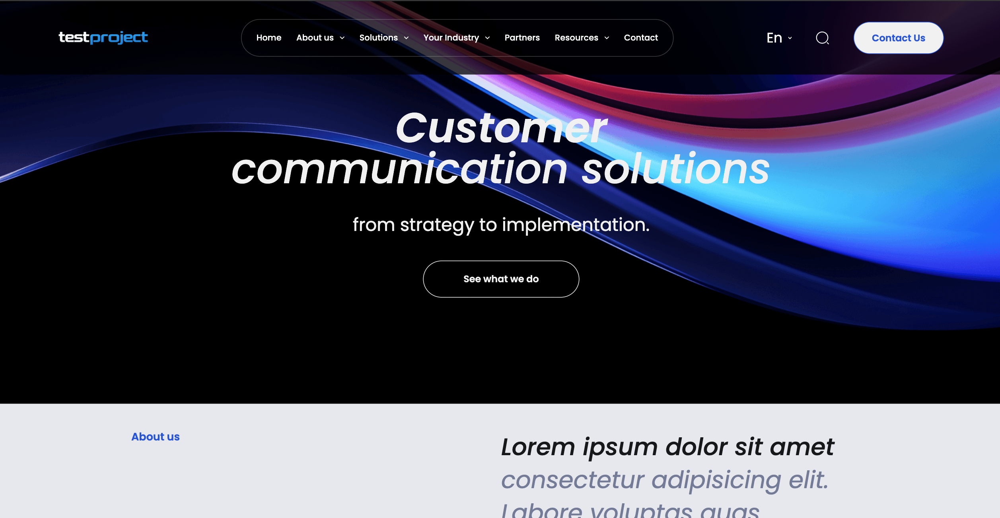 | 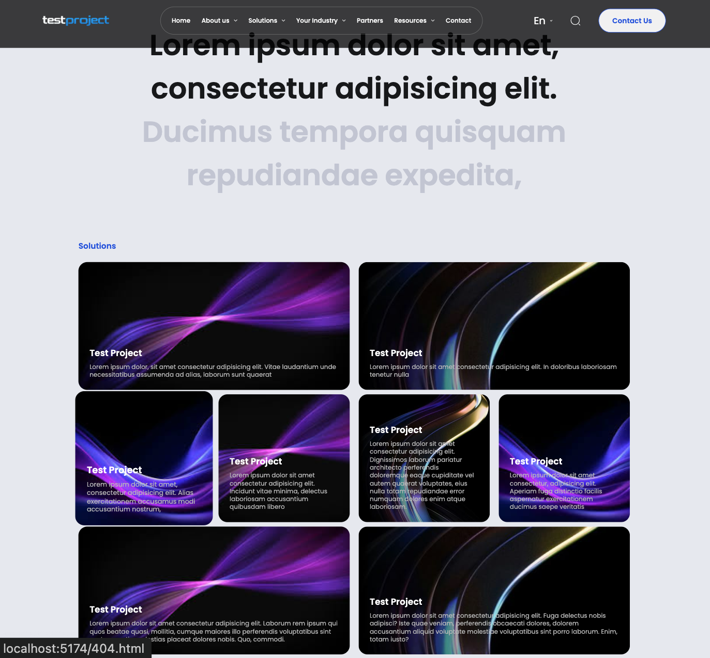 |

| Desktop navigation (dropdown + search open)         | Mobile burger menu (nested categories open)         |
| --------------------------------------------------- | --------------------------------------------------- |
| 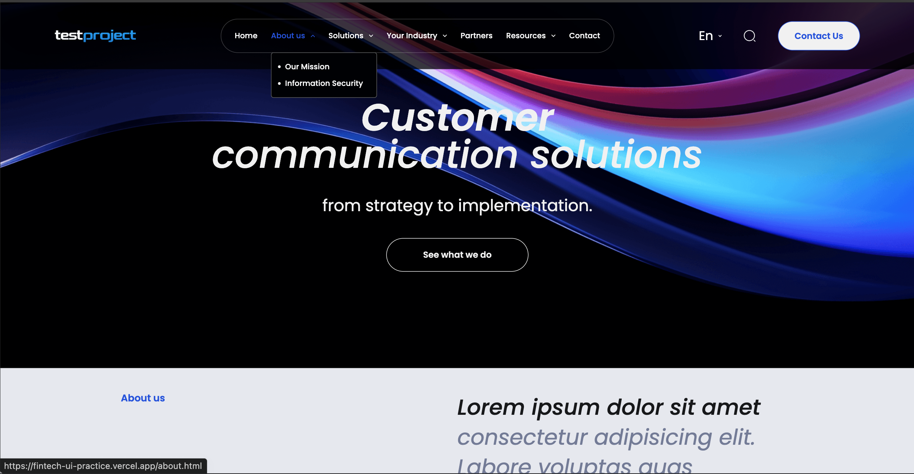 | 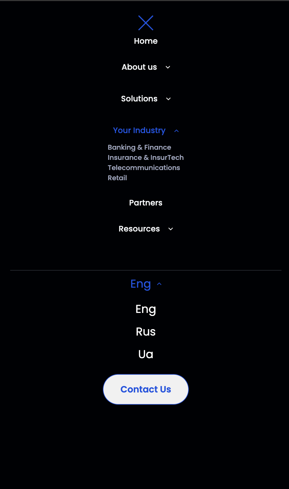 |

| Partners & case studies slider                              | Industry page — accordion open                           |
| ----------------------------------------------------------- | -------------------------------------------------------- |
| 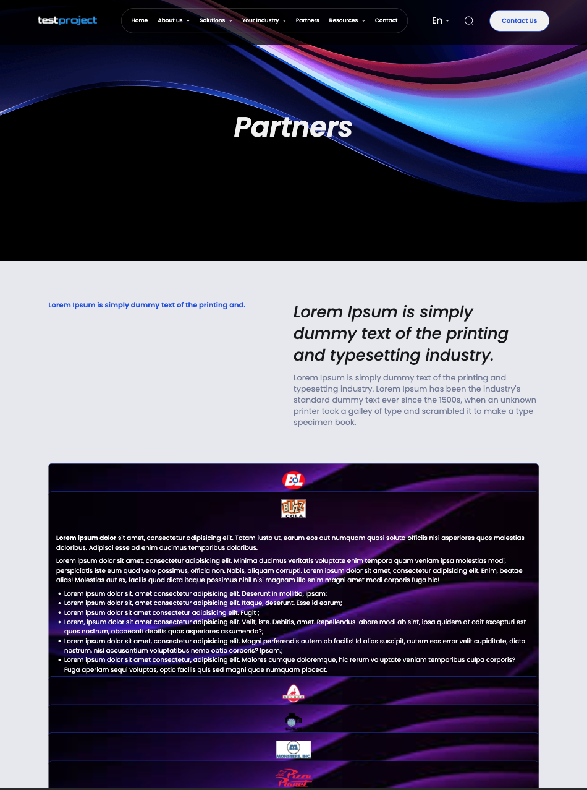 | 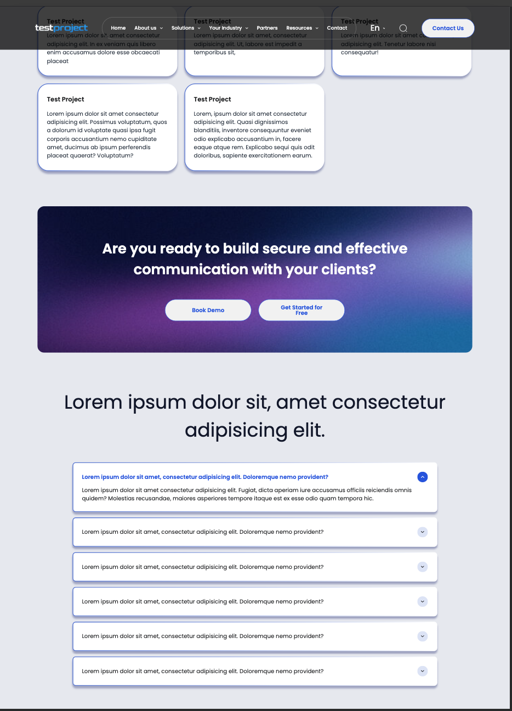 |

| News listing page                                     | News article page                                     |
| ----------------------------------------------------- | ----------------------------------------------------- |
| 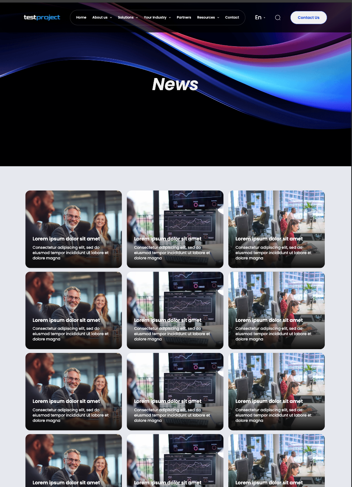 | 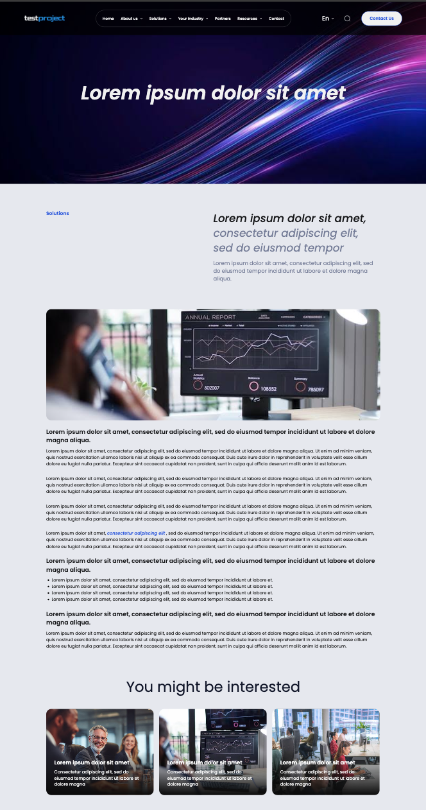 |

| Contact form                                          | Success feedback popup                                 |
| ----------------------------------------------------- | ------------------------------------------------------ |
| 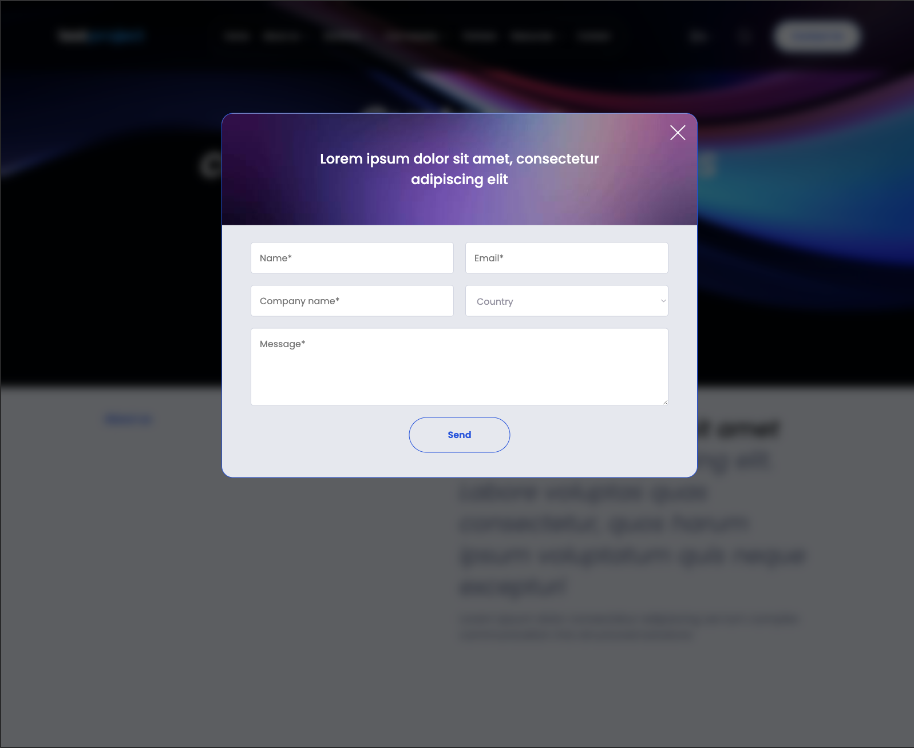 | 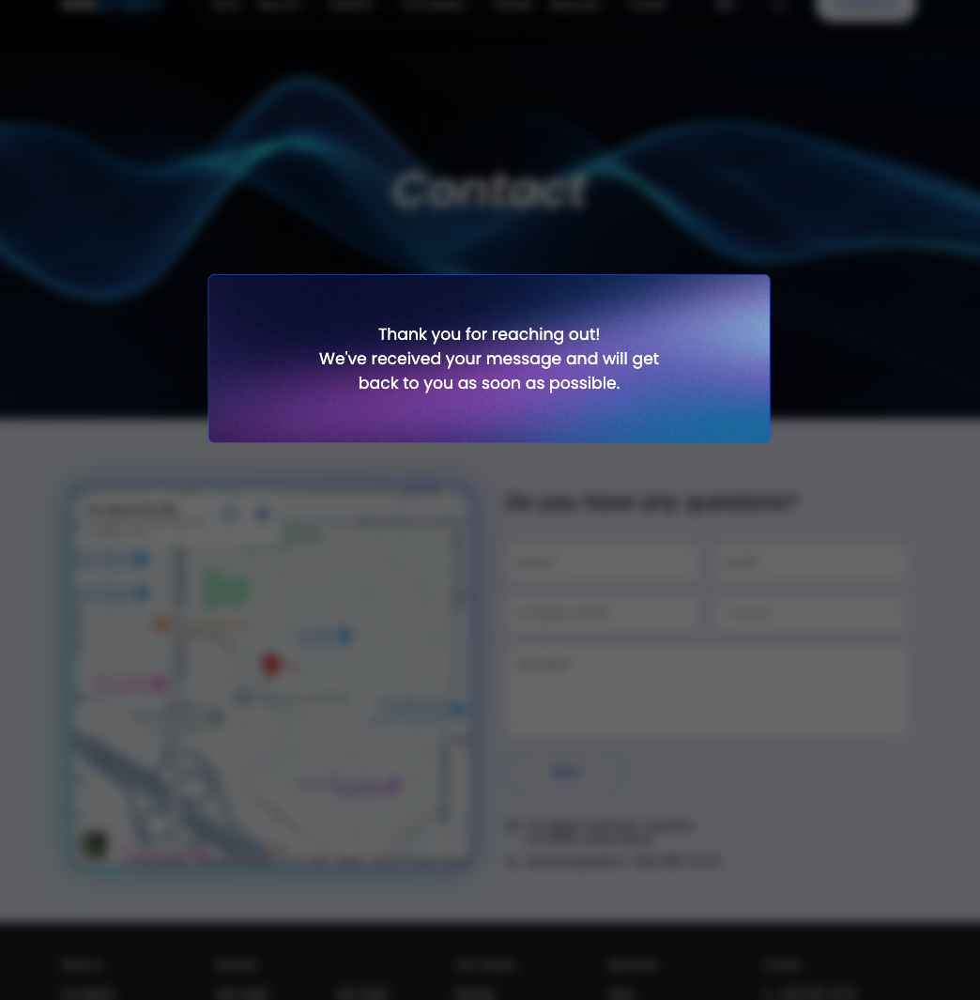 |

| Mobile view (homepage)                                      | 404 page                                      |
| ----------------------------------------------------------- | --------------------------------------------- |
| 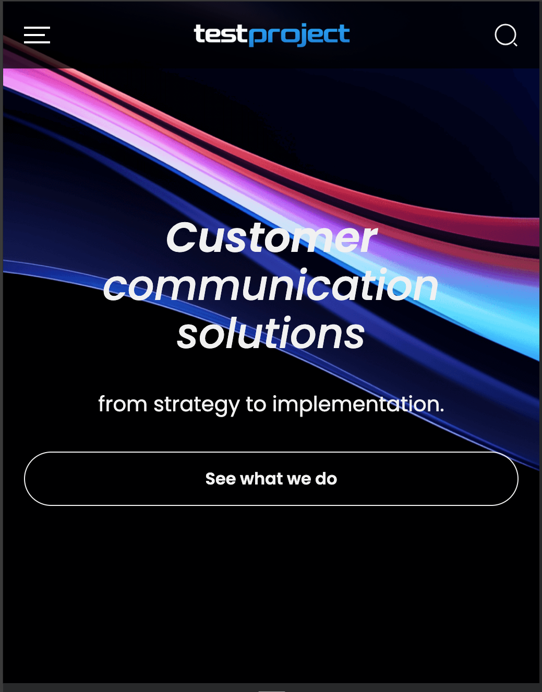 | 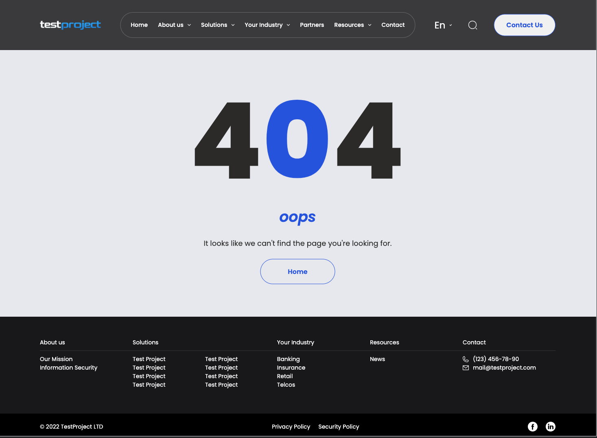 |

## Tech stack

- HTML5
- SCSS / Sass
- Vanilla JavaScript (ES modules)
- [Vite](https://vite.dev/)
- [Swiper](https://swiperjs.com/)
- Vercel Functions
- Git and GitHub

## Project structure

```text
.
├── index.html                   # Homepage
├── about.html                   # Company information
├── solutions.html               # Solutions overview
├── industry.html                # Industry content
├── insurance.html               # Industry page example
├── partners.html                # Partners and case studies
├── news.html                    # News listing
├── news-article-1.html          # News article
├── news-article-2.html          # News article
├── news-article-3.html          # News article
├── contact.html                 # Contact page
├── privacy_policy.html
├── security_policy.html
├── 404.html
├── api/
│   └── submit.js                 # Vercel serverless form endpoint
├── src/
│   ├── js/
│   │   ├── modules/               # Header, modal, sliders, forms, accordion, animation
│   │   └── script.js               # Application entry point
│   ├── sass/
│   │   ├── base/                   # Global styles
│   │   ├── blocks/                 # Page-section styles
│   │   ├── libs/                    # Fonts and third-party styles
│   │   └── style.scss                # Main style entry point
│   ├── img/                          # Images and SVG icons
│   └── fonts/                        # Local Poppins font files
└── vite.config.js
```

## Local development

```bash
git clone https://github.com/Maksim-9999/fintech-ui-practice.git
cd fintech-ui-practice
npm install
npm run dev
```

### Testing the contact form locally

The contact form submits to `/api/submit`, a Vercel serverless function. Plain `npm run dev` (Vite only) won't run it — use the Vercel CLI instead, without installing anything globally:

```bash
npx vercel dev
```

### Available commands

| Command           | Description                                         |
| ----------------- | --------------------------------------------------- |
| `npm run dev`     | Start the Vite development server                   |
| `npx vercel dev`  | Run the frontend together with the local Vercel API |
| `npm run build`   | Create a production build                           |
| `npm run preview` | Preview the production build locally                |

## Contact form

The form collects name, email, company name, country, and message, then sends valid submissions to:

```
POST /api/submit
```

The endpoint validates required fields and returns a success response. The demo does not store, email, or otherwise process personal data.

## Deployment

The project is prepared for deployment on Vercel:

1. Import the repository in Vercel.
2. Vercel detects Vite automatically.
3. Use the default build command:
   ```bash
   npm run build
   ```
4. Vercel publishes the static site, the clean-URL rewrites, and the `/api/submit` serverless function.

## What I practised

- Structuring a larger, multi-page frontend project with a shared design system
- Building responsive layouts across many page types (marketing, listing, article, legal)
- Working with Sass modules and reusable, block-based styles
- Implementing nested mobile navigation and interactive header states without a framework
- Integrating third-party JavaScript libraries (Swiper)
- Building an accordion and scroll-triggered animations from scratch
- Building a serverless API endpoint for a contact form
- Preparing a multi-page project for production deployment with clean URLs

## Future improvements

- Connect form submissions to email or Telegram notifications
- Replace demo links and content with production-ready copy
- Add automated tests and linting
- Optimize large image assets and add lazy loading

## License

This project is licensed under the MIT License — see the [LICENSE](LICENSE) file for details.

## Author

**Maksim Duljuk**
GitHub: [@Maksim-9999](https://github.com/Maksim-9999)
